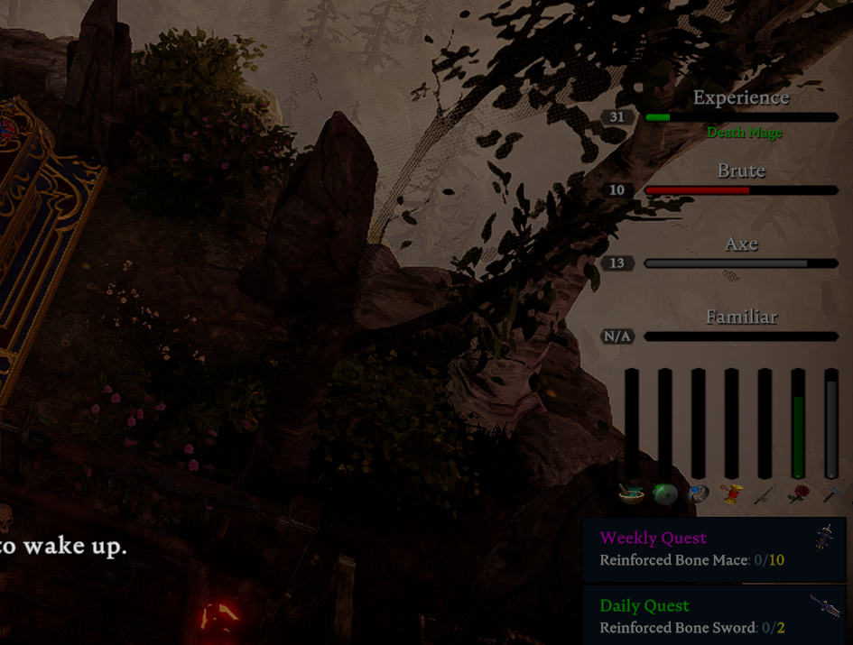
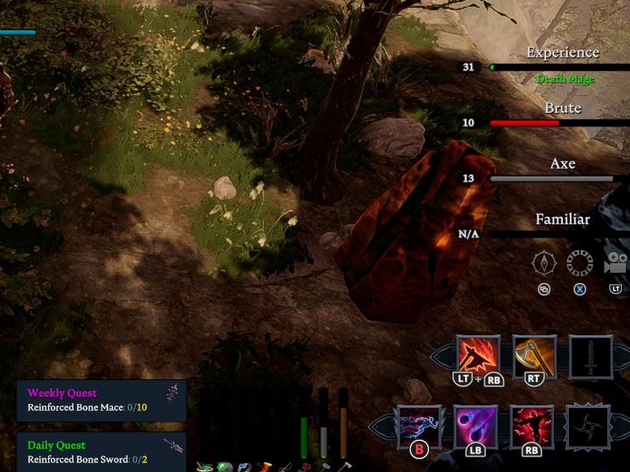

# V Rising Eclipse UI installer

This toolkit is for players on Windows and Linux.

Purpose:
- One-command install of optional Eclipse UI for Bloodcraft progress HUD.
- One-command uninstall if the player wants to revert.
- One-click Windows launcher.

Important:
- Base gameplay works without this toolkit.
- This is only for optional client-side UI overlays.

## What this installs

- `BepInEx/BepInExPack_V_Rising` (if missing)
- `Eclipse` by default (`zfolmt/Eclipse`) for maximum compatibility
  - Optional alternate choice: `EclipsePlus` (`DiNaSoR/EclipsePlus`)

Reference links:
- Eclipse: [zfolmt/Eclipse](https://thunderstore.io/c/v-rising/p/zfolmt/Eclipse/)
- EclipsePlus: [DiNaSoR/EclipsePlus](https://thunderstore.io/c/v-rising/p/DiNaSoR/EclipsePlus/)
- Bloodcraft: [zfolmt/Bloodcraft](https://thunderstore.io/c/v-rising/p/zfolmt/Bloodcraft/)

## Play On Our Server

Once installed, if you want to play with this UI, try it on our live modded servers:
- Server list names:
  - `[US] MOONRISE | Brutal PvE | RPG Mods | No Wipe`
  - `[US] MOONRISE | Normal PvE | RPG Mods | No Wipe`
- Discord: [discord.gg/GK3ZhJZfj3](https://discord.gg/GK3ZhJZfj3)
- Server updates, patch notes, and game info are posted there.

## In-Game UI Screenshots

### Keyboard/Mouse UI Layout



### Controller UI Layout



## Eclipse vs EclipsePlus

- `Eclipse` (default/recommended):
  - Most compatible choice for mixed player environments
  - Lower risk of "UI visible but bars not updating"
- `EclipsePlus` (optional):
  - Fork/variant with different behavior
  - Can work well, but is more sensitive to version compatibility

## Linux Usage

```bash
cd vrising-eclipse-client-installer
chmod +x player-ui-linux.sh

# auto-detect game directory, install Eclipse (default)
./player-ui-linux.sh install

# choose EclipsePlus instead
./player-ui-linux.sh install --ui eclipseplus

# check current install status
./player-ui-linux.sh status

# uninstall Eclipse UI files only
./player-ui-linux.sh uninstall

# full uninstall (Eclipse + BepInEx runtime files)
./player-ui-linux.sh uninstall --full
```

If auto-detect fails:

```bash
./player-ui-linux.sh install --game-dir "/path/to/Steam/steamapps/common/VRising"
```

## Windows Usage (PowerShell)

```powershell
cd path\to\vrising-eclipse-client-installer

# auto-detect game directory, install Eclipse (default)
powershell -ExecutionPolicy Bypass -File .\player-ui-windows.ps1 -Action Install

# choose EclipsePlus instead
powershell -ExecutionPolicy Bypass -File .\player-ui-windows.ps1 -Action Install -Ui eclipseplus

# check current install status
powershell -ExecutionPolicy Bypass -File .\player-ui-windows.ps1 -Action Status

# uninstall Eclipse UI files only
powershell -ExecutionPolicy Bypass -File .\player-ui-windows.ps1 -Action Uninstall

# full uninstall (Eclipse + BepInEx runtime files)
powershell -ExecutionPolicy Bypass -File .\player-ui-windows.ps1 -Action Uninstall -Full
```

If auto-detect fails:

```powershell
powershell -ExecutionPolicy Bypass -File .\player-ui-windows.ps1 -Action Install -GameDir "C:\Program Files (x86)\Steam\steamapps\common\VRising"
```

Windows auto-detect behavior:
- checks default Steam install paths,
- checks Steam registry + `libraryfolders.vdf` entries,
- then checks common SteamLibrary layouts across all mounted drives.

## Windows One-Click (Double-Click)

Inside this repo folder, players can double-click:

- `PlayerUI-Install.cmd` — install Eclipse (recommended default)
- `PlayerUI-Install-EclipsePlus.cmd` — install EclipsePlus
- `PlayerUI-Status.cmd` — print status
- `PlayerUI-Uninstall.cmd` — remove Eclipse UI only
- `PlayerUI-FullUninstall.cmd` — remove Eclipse + BepInEx runtime files
- `PlayerUI-Launcher.cmd` — interactive menu with all options

## Troubleshooting

- Launch the game once from Steam after install.
- If no UI appears:
  - confirm server-side Bloodcraft/Eclipsed settings are enabled,
  - confirm plugin DLL exists in `BepInEx/plugins`,
  - restart game after install.
- If UI appears but bars stay empty:
  - uninstall and reinstall with default `Eclipse` (most compatible),
  - if you tested `EclipsePlus`, switch to `Eclipse`,
  - verify progression commands in-game (`.lvl get`, `.wep get`, `.bl get`).
- If anti-cheat dialogs appear, ensure the server expects modded clients for optional UI.
